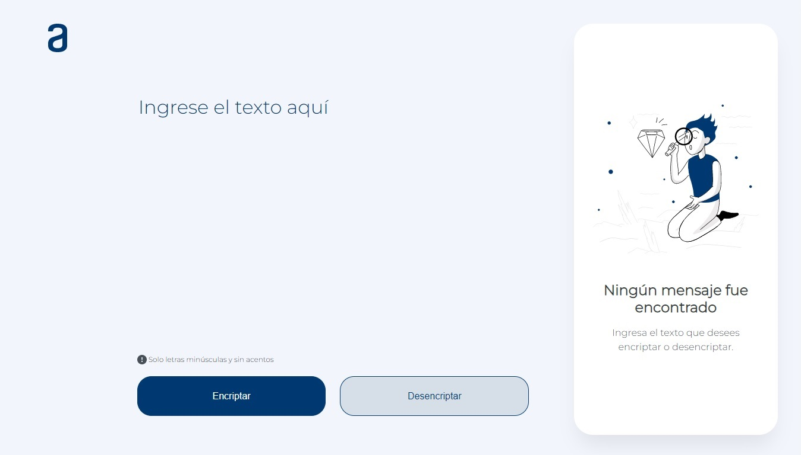

# 
 Challenge ONE: Encriptador de Texto 🔐

Alura LATAM + Oracle ONE

## 🔗 Enlace al proyecto
### Puedes visitar este proyecto dando clic aquí: 👉[Encriptador Alura](https://stratogavo.github.io/Challenge-ONE-Encriptador-Texto/)
## 🗒 Descripción del proyecto

### Este desafío consiste en desarrollar una aplicación web capaz de encriptar y desencriptar texto mediante un método de cifrado por sustitución.
### Proyecto desarrollado para el bootcamp de Alura en sociedad con Oracle. 

## ✅ Requisitos solicitados

### ➡ Debe funcionar solo con letras minúsculas
### ➡ No deben ser utilizados letras con acentos ni caracteres especiales
### ➡ Debe ser posible convertir una palabra para la versión encriptada también devolver una palabra encriptada para su versión    original.

## ➕ Extras

#### ➡ Un botón que copie el texto encriptado/desencriptado para la sección de transferencia, o sea que tenga la misma funcionalidad del ctrl+C o de la opción "copiar" del menú de las aplicaciones.

#### ➡ Diseño responsivo que se adapta a diferentes resoluciones de monitor, teléfono celular o tablet.

#### ➡ Llaves de encriptación almacenadas dentro de un objeto de javascript para mayor flexibilidad al agregar, modificar o eliminarlas.

## 🔎 Llaves de encriptación

#### La letra "e" es convertida para "enter"
#### La letra "i" es convertida para "imes"
#### La letra "a" es convertida para "ai"
#### La letra "o" es convertida para "ober"
#### La letra "u" es convertida para "ufat"

## ⚙ Tecnologías

  

 

 

